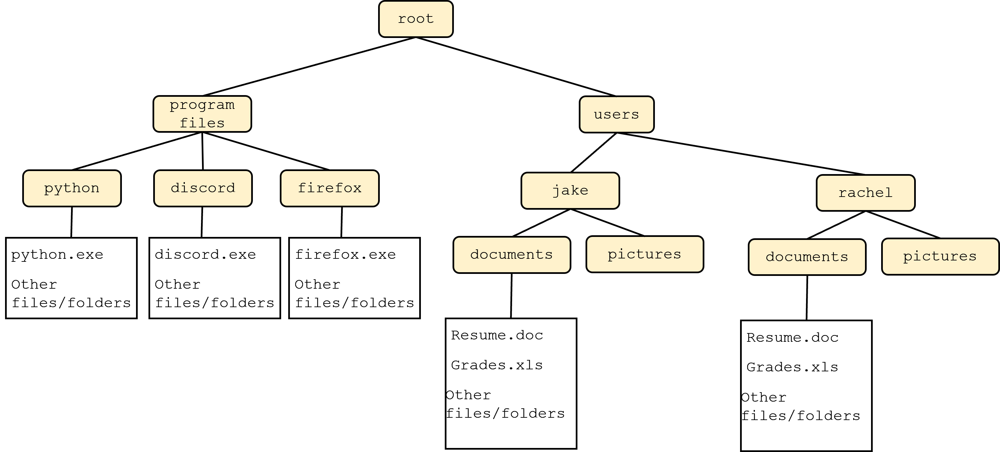

# Mod 1 Lab - Python Fundamentals

This lab will walk you through the process of:

* navigating your computer's file structure
   * create new files and folders
* writing python code
* running python code

This lab is cooperative - talk with your partner as you go through, and make sure you are progressing together. It is fine for only one person to be coding during lab while the other looks on and discusses what's happening - this is called **pair programming**. Make sure to share the files at the end, since both lab partners **must submit individually** to recieve credit.

## Part 1 - Setup your filesystem

All modern operating systems use a hierarchal file structure. We can think of this as a tree - the top level directory, often referred to as `root`, contains all the files and folders on your computer. The exact names of various folders changes based on your operating system, but the general structure is a root directory which contains both the files necessary for various prorams to run and the files created and used by individual users:


It's often nice to collapse this visual diagram to a text-based one, like this:

```
|root
|  |program files
|  |  |python
|  |  |--python.exe
|  |  |--(other files/folders)
|  |
|  |  |discord
|  |  |--discord.exe
|  |  |--(other files/folders)
|  |  
|  |  |firefox
|  |  |--firefox.exe
|  |  |--(other files/folders)
|
|  |users
|  |  |jake
|  |  |  |documents
|  |  |  |--Resume.docx
|  |  |  |--Grades.xls
|  |  |  |--(other files/folders)
|  |  |
|  |  |  |pictures
|  |
|  |  |rachel
|  |  |  |documents
(omitted for space)
```

For this class, we want to create a folder called `cse2050` in your user's directory. On your lab PC, your username will be your netID (e.g. `jas14034`). Then, create a subfolder called `labs`, and another called `lab1`. Put a file called `hello.py` inside of that folder. Your ultimate file structure should look something like this:

```
|root
|  |users
|  |  |jas14034
|  |  |  |cse2050
|  |  |  |  |labs
|  |  |  |  |  |lab1
|  |  |  |  |  |--hello.py
|  (other users omitted)
|
|  |program files
|  |  (program files omitted)
```

Open the folder `lab1` in an **i**ntegrated **d**eveloping **e**nvironment (IDE) of your choice, add some code to print something out, and run it. The lab PCs include Visual Studio and Spyder as IDEs, and you are free to use whatever you want on your local PC for homework assignments.

This can all be a little overwhelming the first time you see it. If you're not sure how to create a folder on your computer, ask around - another classmate or your TA can help. It's important that we get used to asking each other for help; it will make the rest of this course much smoother.

You can also see the attached video `VisualStudio_hello.mp4` to see how to create a folder, open it, create a file in that folder, write some code, and run it on the lab PCs using Visual Studio.


**STOP** - at this point, you *and your partner* should be able to navigate the file structure on your computer, including creating files. You should also be able to write a basic python script, run it, and see its output. Make sure you are comfortable with the above (ask classmates or the TA if you need assistance) before moving on.

## Part 2 – Modifying `hello.py``

Now that your comfortable with your comptuer's file system, it's time to write some more intricate Python code. Add a function `say_hi()` to the file `hello.py` you created in Part 2. This function should just return the string `Hello, world` for now.

```python
def say_hi():
   return "Hello, world"
```

## Part 3 - Submit code to Gradescope

Next, we'll submit our code to Gradescope. Click the `Gradescope` link in HuskyCT, then select the appropriate assignment. Submit the file `hello.py` you made earlier.

The autograder takes a minute or two to run. Once it completes, you should see 10/100 points for this assignment if `hello.py` is correct. Read over the error messages for the test cases you failed to get an idea of why they failed (largely, they depend on the file `lab1.py`, which you have not yet created and did not submit.)

**STOP** - make sure your partner is done here before continuing.

## Rinse and repeat

Now, we'll continue to work on our code and re-submit until we pass all test cases. To complete this assignment, create a new file called `lab1.py`. This file should have a single function named `generic_hi()` which takes one argument: a name to add to the return string:

```bash
>>> generic_hi('jake')
'Hello, jake!'
>>> generic_hi('greninja')
'Hello, greninja!'
>>> generic_hi()
'Hello, world!'
```

Note that your function needs a default value (`'world'` in this case) to plug in to the return string if the user does not specify one.

## External Modules

**Do not use any imported modules (`math`, `collections`, ...) when implementing functionality.** It is okay to use imported modules for testing.

It is okay to import modules you write yourself; e.g. any data structures you write yourself.

## Submitting

**STOP!**. Before you go, make sure to backup your files using a cloud service like Onedrive.

At a minimum, submit the following files for this lab:

   * `hello.py`
   * `lab1.py`

Students must submit **individually** by the due date (typically, Friday at 11:59 pm EST) to receive credit.